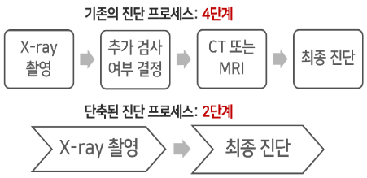

폐질환 의심 응급환자의 진단과정 단축을 위한 AI 흉부 X-ray 진단 보조 서비스
=============

## 주제 구체화 과정
#### `1) 의료 현장 리서치`
- 응급실을 찾는 환자의 절반 이상(56%)이 엑스레이 촬영을 받고 있다. 
- 그 중 흉부외과는 x-ray 촬영률이 90%로 가장 높았다. 
- 흉부손상은 외상으로 인한 사망의 20~25%를 차지할 정도로 적정시기의 적절한 치료가 매우 중요하다. 
- x-ray 진단에 소요되는 시간은 3371초, 약 1시간으로 골든타임이 중요한 응급환자에게는 긴 시간일 것이다. 
- 응급실에서의 대기시간에 대한 만족도 조사에 의하면 40점대로 낮다는 것도 확인할 수 있었다.
- 영상의학과 전문의 인터뷰 진행
    - 유방암 석회 detection 하는 '캐드' 활발히 사용
    - 유용하고 정확한 프로그램이라면 보조기구로써 사용할 의향 있음
    - ‘루닛’, ‘뷰노’ 등의 시제품 🡪 비용 문제 발생

#### `2) 의료 현장 문제점`
- 진단 시간이 많이 걸리는 이유는 x-ray 촬영을 한 후 그 결과를 바탕으로 추가 검사 여부를 결정하게 되며 이 후 ct나 mri 등의 추가 검사를 마친 후에 최종진단에 이르게 되는 4단계의 프로세스로 진행되기 때문이었다. 
- 각 프로세스별 대기시간까지 고려한다면 분명 적지 않은 시간일 것이다.

#### `3) 프로젝트 목표`
- 해결방안 : 응급환경의 시간과 비용의 절감을 위해 추가 검사를 생략한, x-ray 촬영만으로 최종진단에 이르는 단축된 진단 프로세스 개발

- 타겟시장 : 응급실, 구급차 보유 병원
- 고객의 Needs : 적은 데이터로 빠른 시간에 x-ray 사진을 진단&관리할 프로그램 필요
- 기대사항 : 환자의 생존율을 높이고, 이에 소요되는 시간과 비용을 줄이는 것

진단 속도 12초로 응급환자의 x-ray 이미지를 진단할 수 있는 정확도 97.1, auc 84.12의 서비스를 제작했다. 다음은 실제 서비스의 시연 캡처화면이며 x-ray 이미지를 업로드하면 상위 3개의 질병을 확률값과 함께 보여준다. 빨간 박스는 질병으로 의심되는 영역을 표시해 준다.

## Classification
#### `1) 고려한 점`
- 13개의 질병을 분류할 수 있는 모델 생성
- 각 질병에 대한 정확도 출력
- 짧은 시간 안에 높은 정확도를 내야함

#### `2) 데이터`
- 최대한 많은 양의 데이터를 위해 며칠간 서칭
- 신뢰성 있고 전문가에 의해 라벨링이 되어 있는 이미지 데이터 발견
- 데이터 수집 : https://www.kaggle.com/nih-chest-xrays/data
- bounding box 가 있는 데이터를 보고 추후 Detection도 결정

#### `2) 기술 선택 과정`
- 초기 : colab gpu 학습 진행 (1epoch 당 몇시간이 걸릴 정도로 오래 걸림/중간에 꺼짐)
- 이후 : Ubuntu 서버 대여 -> 한 모델 당 2-3일에 학습 가능

- tensorflow에서 제공하는 6가지 CNN model 실험

- imagenet의 pre-trained weight 학습
- test AUC가 가장 높았던 efficientnet model을 fine-tuning하여 사용

#### `3) 정확도를 높이기 위한 시도`
- 다양한 모델 시도
- 기존에 정해져있던 데이터 비율 조정 : Train, Valid, Test 데이터 비율 0.64:0.16:0.2 -> 0.6:0.2:0.2
- Train, Test split 함수의 stratify 옵션을 사용하여 데이터의 질병 분포 유지 (MultilabelStratifiedKFold 이용)
- 같은 환자의 데이터가Train, Valid, Test 데이터 에 모두 나누어 들어가 있었음
    - 같은 환자의 데이터라면 하나만 남기고 삭제
    - 모든 데이터셋에 다른 환자가 들어가도록 설정

## Detection
#### `1) 고려한 점`
- 13개의 질병 위치를 검출할 수 있는 가중치 값 생성
- 

## 웹사이트 결과
#### `1) 고려한 점`
- 환자 관리 : 환자 등록 및 리스팅 가능
- 환자 진단
    - 로컬에서 환자 x-ray 이미지 업로드
    - 12초 진단
    - TOP3 질병 + 각 질병의 확률값 출력
    - 질병 감염 의심 영역 표시
    - 진단 히스토리 열람 및 삭제 가능

#### `2) 기술 선택 과정`
- 언어 선택
    - 딥러닝 기술 사용 -> Tensorflow 필요 -> Python에 최우선으로 맞춰 개발됨 -> __딥러닝 개발 : python 언어 결정__
    - 딥러닝 코드와의 연결 필요 -> __백엔드/프론트엔드 : python 언어 결정__

- 프레임워크 선택
    - python 언어를 사용할 Flask or Django 고민
    - Flask 로 개발 시도 : https://saeyoun.tistory.com/2 
    - 보안, 인증 등의 기능 직접 구현 복잡함 & Flask를 이용한 많은 기능이 구현된 프로젝트를 찾기 어려움
    - Django로 Airbnb 클론코딩이 가능하다는 것을 발견 -> 로그인/이미지업로드/리스팅/상세정보 관리 등 필요한 기능 겹침 -> 토이프로젝트 진행
    - __Django로 개발 결정__ : https://saeyoun.tistory.com/3

#### `3) 결과`

최종 프로그램 구조

이를 구현하기 위해 Classification and Detection 기반 Web Service를 구현했으며, Classification 성능을 향상시키기 위해 PGGAN을 사용하여 합성 의료 X선 데이터를 생성했다. 문제가 있는 부위 특정, X선 처리시간 단축, 응급환자의 정확한 질병분류 등 의료과정의 효율성 향상에 활용될 것으로 기대된다.

## :sparkles:1. Classification

###### Weights: [Google Drive Link](https://drive.google.com/drive/folders/1-uo9GchtOoAFvXmE0zpPi0eaFgKNOrk6?usp=sharing)

## :sparkles:2. Detection

###### Training Data: [Google Drive Link](https://drive.google.com/drive/folders/11CUJGctnzHQcsq9O3WCSTRhgRjkMOOUN?usp=sharing)
###### Ultralytics Yolov5 : https://github.com/ultralytics/yolov5

###### Result of NIH Data: [Google Drive Link](https://drive.google.com/drive/folders/1qo_5ICzeMUrHQ_-s0Z9d3KYSLCrNzqRl?usp=sharing)
###### Result of ChestX Data : [Google Drive Link](https://drive.google.com/drive/folders/1NBvWFz3Fto6ZqeLrqopEMlbUZnNpxodN?usp=sharing)
###### Result of NIH & ChestX Data: [Google Frive Link](https://drive.google.com/drive/folders/1Koryg3pxeUs7oJ0ulO7FEjrq0EMPB6of?usp=sharing)

## :sparkles:3. GAN Research

###### Generated Image(PGGAN1): [Google Drive Link](https://drive.google.com/drive/folders/1qJj4dn9ap-fPbrHuP2OR9f7_tTKUm58L?usp=sharing)
###### Generated Image(PGGAN2): [Google Drive Link](https://drive.google.com/drive/folders/1IWavLvJQTNJ_Ui-s0R7is2MTI1Q3naOe?usp=sharing)
###### Generated Image(PGGAN3): [Google Drive Link](https://drive.google.com/drive/folders/1q1PmqqxZPPGEzazGkzOXv4WF1G5zFNO1?usp=sharing)
###### PGGAN Weights: [Google Drive Link](https://drive.google.com/drive/folders/1Y9l7wqjt-cKR-gJRIe8DqZwbG91nyXEy?usp=sharing)

###### Generated Image(DCGAN): [Google Drive Link](https://drive.google.com/drive/folders/18MekMJsuhZS6Shu3T6nvmNihK4M4oilz?usp=sharing)

## :book:Papers
###### 1. 폐질환 의심 응급환자의 진단 과정 단축을 위한 AI기반 X-ray진단 시스템
###### https://drive.google.com/file/d/1FnQGBRWvJ70iH2Rut0L7hjO-4Bt15vpc/view?usp=sharing
###### 2. PGGAN synthetic data를 활용한 Class간 데이터분포의 불균형 완화가 X-ray 질병 진단 정확도에 미치는 영향 연구
###### https://drive.google.com/file/d/1OPLWdxKm7L0jW0QhTIYEo4-7AER3-JNz/view?usp=sharing

## :REFERENCE
###### https://www.koreascience.or.kr/article/JAKO201123736032447.pdf
